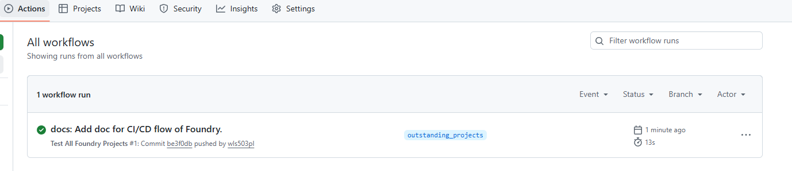

# CI/CD Guide for Foundry Projects

## What is CI/CD?

CI/CD is a core practice in modern software development, referring to **Continuous Integration (CI)** and **Continuous Delivery/Deployment (CD)**.

### Continuous Integration (CI)

Developers frequently (usually multiple times per day) merge code changes into the main branch. Each commit automatically triggers a build and test process to quickly identify issues. This prevents "integration hell" - massive conflicts that occur when multiple developers work independently for extended periods before merging their code.

### Continuous Delivery (CD - Delivery)

Ensures code is always in a deployable state. Through automated testing and deployment preparation, code can be deployed to production at any time, but actual deployment requires manual approval.

### Continuous Deployment (CD - Deployment)

Takes it further - all code changes that pass tests are automatically deployed to production without human intervention.

## Typical CI/CD Workflow

1. Developer commits code to version control system (e.g., Git)
2. Automatically triggers CI pipeline: compile code, run unit tests
3. If tests pass, perform integration tests and code quality checks
4. Build deployment package, deploy to test/staging environment
5. Deploy to production (automatically or manually)

## CI/CD Implementation: GitHub Actions

There are many ways to implement CI/CD pipelines. In this project, we use **GitHub Actions** - one of the most popular and widely-used CI/CD platforms that's natively integrated with GitHub repositories.

### Why GitHub Actions?

-   ✅ **Native Integration** - Built directly into GitHub, no external setup needed
-   ✅ **Free for Public Repos** - Unlimited minutes for open source projects
-   ✅ **Easy Configuration** - Simple YAML files in `.github/workflows/`
-   ✅ **Rich Ecosystem** - Thousands of pre-built actions available
-   ✅ **Visual Feedback** - See workflow status directly in your repository

### Viewing Workflow Status

Once your workflow is set up and triggered, you can monitor its progress in the Actions tab:



This interface shows:

-   **All workflows** - List of all configured workflows in your repository
-   **Workflow runs** - Complete history of all executions with timestamps
-   **Status indicators** - Green ✓ for success, Red ✗ for failure, Yellow ● for in-progress
-   **Manual trigger button** - "Run workflow" button for manual execution (when `workflow_dispatch` is enabled)
-   **Detailed logs** - Click any run to see step-by-step execution details and debugging information

## Setting Up CI/CD for This Project

This guide will help you create a CI/CD workflow in the `advanced_foundry/` root directory. When you add new subprojects, simply add a new job to the main YAML file.

### Step 1: Create Workflow File

```bash
cd advanced_foundry

# Create .github/workflows directory
mkdir -p .github/workflows

# Create workflow file
nano .github/workflows/test.yml
# Or use your preferred editor: vim, code, gedit, etc.
```

### Step 2: Add Workflow Configuration

Paste this content into `test.yml`:

```yaml
name: Test All Foundry Projects

on:
    push:
        branches: [main, master]
    pull_request:
        branches: [main, master]
    workflow_dispatch: # Allow manual trigger

jobs:
    test-erc20:
        name: Test ERC20
        runs-on: ubuntu-latest

        steps:
            - uses: actions/checkout@v3
              with:
                  submodules: recursive

            - name: Install Foundry
              uses: foundry-rs/foundry-toolchain@v1

            - name: Run ERC20 tests
              working-directory: foundry_erc20
              run: |
                  forge test -vvv
                  forge coverage
```

**Key Configuration Explained:**

-   `on: push` - Triggers on code push to main/master branch
-   `on: pull_request` - Triggers on pull requests
-   `workflow_dispatch` - Enables manual triggering
-   `working-directory` - Specifies which subproject to test
-   `forge test -vvv` - Run tests with verbose output
-   `forge coverage` - Generate test coverage report

### Step 3: Push to GitHub

```bash
# Check current status
git status

# Add all files
git add .

# Commit changes
git commit -m "ci: add GitHub Actions workflow for Foundry tests"

# Push to GitHub
git push
```

### Step 4: View Results

After pushing, go to GitHub:

1. Open your `advanced_foundry` repository
2. Click the "Actions" tab at the top
3. You'll see the workflow running
4. Green ✓ means tests passed, Red ✗ means tests failed

## Triggering Methods

### Automatic Trigger

The workflow automatically runs when you:

-   Push code to main/master branch
-   Create or update a pull request

### Manual Trigger

With `workflow_dispatch` enabled, you can manually trigger the workflow:

1. Go to GitHub repository
2. Click "Actions" tab
3. Select "Test All Foundry Projects" from the left sidebar
4. Click "Run workflow" button on the right
5. Select the branch and click the green "Run workflow" button

## Adding New Projects

When you add a new Foundry project (e.g., `foundry_nft`), simply add a new job to the same YAML file:

```yaml
name: Test All Foundry Projects

on:
    push:
        branches: [main, master]
    pull_request:
        branches: [main, master]
    workflow_dispatch:

jobs:
    test-erc20:
        name: Test ERC20
        runs-on: ubuntu-latest
        steps:
            - uses: actions/checkout@v3
              with:
                  submodules: recursive
            - name: Install Foundry
              uses: foundry-rs/foundry-toolchain@v1
            - name: Run ERC20 tests
              working-directory: foundry_erc20
              run: forge test -vvv

    test-nft: # New job for NFT project
        name: Test NFT
        runs-on: ubuntu-latest
        steps:
            - uses: actions/checkout@v3
              with:
                  submodules: recursive
            - name: Install Foundry
              uses: foundry-rs/foundry-toolchain@v1
            - name: Run NFT tests
              working-directory: foundry_nft # New project directory
              run: forge test -vvv
```

## Advanced Configuration

### Run Tests in Parallel

Jobs run in parallel by default, speeding up your CI/CD pipeline.

### Add Deployment Steps

```yaml
deploy-production:
    name: Deploy to Production
    needs: [test-erc20, test-nft] # Run only after all tests pass
    runs-on: ubuntu-latest
    if: github.ref == 'refs/heads/main' # Only deploy from main branch

    steps:
        - uses: actions/checkout@v3
        - name: Install Foundry
          uses: foundry-rs/foundry-toolchain@v1
        - name: Deploy contracts
          env:
              PRIVATE_KEY: ${{ secrets.PRIVATE_KEY }}
              RPC_URL: ${{ secrets.RPC_URL }}
          run: |
              forge script script/DeployOurToken.s.sol --rpc-url $RPC_URL --private-key $PRIVATE_KEY --broadcast
```

### Add Code Coverage Reports

```yaml
- name: Generate coverage report
  run: forge coverage --report lcov

- name: Upload coverage to Codecov
  uses: codecov/codecov-action@v3
  with:
      files: ./lcov.info
```

## Benefits of CI/CD

✅ **Early Bug Detection** - Issues found immediately after commit
✅ **Reduced Integration Issues** - Frequent merges prevent conflicts
✅ **Faster Development** - Automated testing saves time
✅ **Higher Code Quality** - Enforces standards and best practices
✅ **Deployment Confidence** - Tested code reduces production errors
✅ **Team Collaboration** - Everyone sees test results in real-time

## Common CI/CD Tools Comparison

-   **GitHub Actions** - Integrated with GitHub (what we're using) - Best for GitHub-hosted projects
-   **Jenkins** - Self-hosted, highly customizable - Best for complex enterprise workflows
-   **GitLab CI** - Built into GitLab - Best for GitLab users
-   **CircleCI** - Cloud-based CI/CD - Best for fast, scalable pipelines
-   **Travis CI** - Popular for open source projects - Best for simple open source CI

## Troubleshooting

### Workflow Not Running?

1. Check file path: `.github/workflows/test.yml` (exact spelling)
2. Verify YAML syntax (indentation matters!)
3. Ensure you pushed to the correct branch (main/master or your configured branch)
4. Check Actions tab for error messages
5. Verify GitHub Actions is enabled in repository settings

### Tests Failing in CI but Pass Locally?

1. Check Foundry version compatibility
2. Verify all dependencies are properly installed
3. Ensure submodules are checked out (`submodules: recursive`)
4. Review error logs in GitHub Actions
5. Check environment variables and secrets configuration

### Need More Free Minutes?

-   Public repositories: Unlimited GitHub Actions minutes
-   Private repositories: 2000 free minutes/month
-   Consider self-hosting runners for unlimited usage

## Best Practices

1. **Keep workflows fast** - Slow CI discourages frequent commits
2. **Run critical tests first** - Fail fast to save time
3. **Use caching** - Cache dependencies to speed up builds
4. **Secure secrets** - Never commit private keys or API keys
5. **Monitor regularly** - Fix broken builds immediately
6. **Document workflow** - Help team understand CI/CD process

## Resources

-   [GitHub Actions Documentation](https://docs.github.com/en/actions)
-   [Foundry CI/CD Examples](https://book.getfoundry.sh/tutorials/best-practices)
-   [YAML Syntax Guide](https://yaml.org/spec/1.2/spec.html)

## Core Value

The core value of CI/CD is **reducing human error through automation, accelerating delivery speed, and improving software quality and team efficiency**.

---

_Remember: Good CI/CD practices lead to better code, happier developers, and more reliable deployments!_
