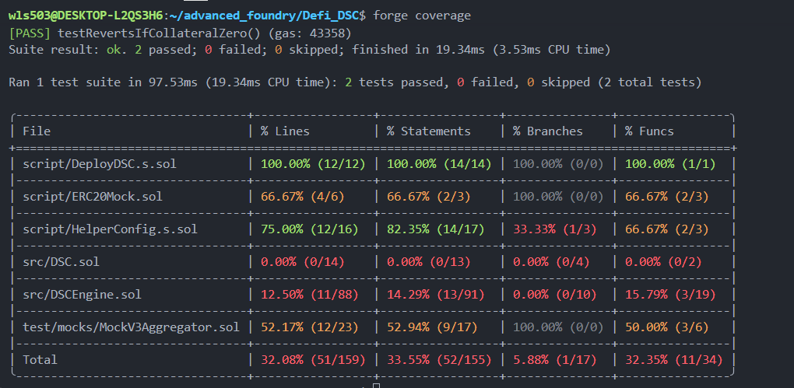
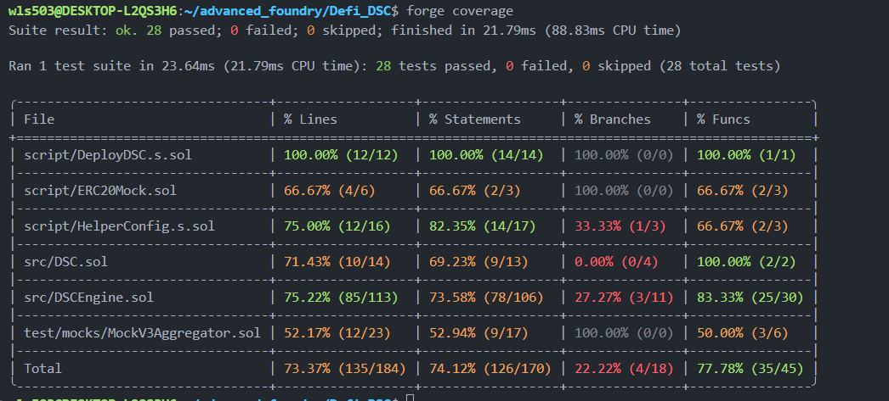

# DSCEngine Unit Test Documentation

> **Last Updated:** December 21, 2025  
> **Test File:** `test/unit/DSCEngineTest.t.sol`  
> **Total Tests:** 28  
> **Status:** ✅ All Passing

---

## Overview

Comprehensive unit test suite for the DSCEngine contract covering all core functionality:

-   Price conversions (USD ↔ Token)
-   Collateral deposits and withdrawals
-   DSC minting and burning
-   Health factor calculations
-   Getter functions and state queries

**Test Framework:** Foundry (Forge)

---

## Test Categories

### 1. Constructor Tests (1 test)

| Test                                              | Purpose                                     | Coverage       |
| ------------------------------------------------- | ------------------------------------------- | -------------- |
| `testRevertsIfTokenLengthDoesntMatchPriceFeeds()` | Validates constructor array length matching | Error handling |

**Key Point:** Ensures token and price feed arrays must have equal length to prevent misconfiguration.

---

### 2. Price Conversion Tests (2 tests)

#### `testGetUsdValue()`

-   **Purpose:** Verify token → USD conversion accuracy
-   **Scenario:** 15 ETH @ $2000/ETH = $30,000
-   **Validates:** Chainlink precision handling (8 decimals → 18 decimals)

#### `testGetTokenAmountFromUsd()`

-   **Purpose:** Verify USD → token conversion accuracy
-   **Scenario:** $100 USD @ $2000/ETH = 0.05 ETH
-   **Validates:** Reverse calculation and decimal handling

**Key Point:** These are the foundation for all collateral valuations.

---

### 3. Deposit Collateral Tests (4 tests)

#### `testRevertsIfCollateralZero()`

-   **Purpose:** Enforce moreThanZero modifier
-   **Expected Outcome:** Revert with `DSCEngine__NeedsMoreThanZero`

#### `testRevertsWithUnapprovedCollateral()`

-   **Purpose:** Prevent non-whitelisted tokens from being used
-   **Expected Outcome:** Revert with `DSCEngine__NotAllowedToken`
-   **Scenario:** Try to deposit a random ERC20 token

#### `testCanDepositCollateralAndGetAccountInfo()`

-   **Purpose:** Successful single-token deposit
-   **Validates:**
    -   Collateral is recorded correctly
    -   Account info returns accurate values

#### `testCanDepositMultipleCollateralTypes()`

-   **Purpose:** User can deposit both wETH and wBTC
-   **Validates:**
    -   Multiple collateral tokens are tracked separately
    -   Total collateral value is sum of all tokens

**Key Point:** Users can mix different collateral types in a single account.

---

### 4. Mint DSC Tests (3 tests)

#### `testRevertsIfMintAmountIsZero()`

-   **Purpose:** Enforce moreThanZero modifier
-   **Expected Outcome:** Revert with `DSCEngine__NeedsMoreThanZero`

#### `testRevertsIfMintBreaksHealthFactor()`

-   **Purpose:** Successful minting with good health factor
-   **Scenario:** User with $10,000 collateral mints $100 DSC (safe)
-   **Validates:** Health factor check passes for valid debt

#### `testCanMintDscWithCollateral()`

-   **Purpose:** Successful DSC minting
-   **Validates:** User receives correct amount of DSC tokens

#### `testCanDepositAndMintInSingleTransaction()`

-   **Purpose:** Gas-efficient combined operation
-   **Validates:** `depositCollateralAndMintDsc()` works correctly

**Key Point:** Users can only mint if health factor remains ≥ 1.0 (200% collateralized minimum).

---

### 5. Burn DSC Tests (3 tests)

#### `testRevertsIfBurnAmountIsZero()`

-   **Purpose:** Enforce moreThanZero modifier
-   **Expected Outcome:** Revert with `DSCEngine__NeedsMoreThanZero`

#### `testCanBurnDsc()`

-   **Purpose:** Successful DSC burning
-   **Scenario:** Burn half of minted DSC
-   **Validates:** DSC tokens are removed from user's balance

#### `testBurnImproveHealthFactor()`

-   **Purpose:** Verify burning debt improves health factor
-   **Scenario:**
    -   Before: 100 DSC minted → HF = 100
    -   After burning 50 DSC → HF = 200
-   **Validates:** Health factor improves proportionally

**Key Point:** Burning DSC is the primary mechanism to improve undercollateralized positions.

---

### 6. Redeem Collateral Tests (4 tests)

#### `testRevertsIfRedeemAmountIsZero()`

-   **Purpose:** Enforce moreThanZero modifier
-   **Expected Outcome:** Revert with `DSCEngine__NeedsMoreThanZero`

#### `testCanRedeemCollateral()`

-   **Purpose:** Successful collateral withdrawal (no debt)
-   **Scenario:** User deposits 10 ETH, then redeems all 10 ETH
-   **Validates:** Collateral is transferred back to user

#### `testRevertsIfRedeemBreaksHealthFactor()`

-   **Purpose:** Cannot withdraw if it violates health factor
-   **Scenario:** User has no debt, redeems successfully
-   **Validates:** Health factor check prevents excessive withdrawals

#### `testCanRedeemCollateralForDsc()`

-   **Purpose:** Combined burn + redeem operation
-   **Scenario:**
    -   Deposit 10 ETH, mint 100 DSC
    -   Burn 100 DSC, redeem all 10 ETH
-   **Validates:** Zero debt and zero collateral after redemption

**Key Point:** Redemptions are blocked if health factor would fall below 1.0.

---

### 7. Health Factor Tests (1 test)

#### `testProperHealthFactorCalculation()`

-   **Purpose:** Verify health factor formula accuracy
-   **Scenario:**
    -   Collateral: 10 ETH @ $2000 = $20,000
    -   Debt: 100 DSC minted
    -   Expected HF: ($20,000 × 50%) / 100 = 100.0
-   **Validates:** Health factor = 1e18 scales correctly

**Formula:** `HF = (Collateral × 50% Threshold) / Debt Minted`

**Interpretation:**

-   HF > 1.0: Safe (overcollateralized)
-   HF = 1.0: At liquidation threshold
-   HF < 1.0: Liquidatable (undercollateralized)

---

### 8. Getter Functions Tests (8 tests)

#### Account Information Getters

| Test                                              | Returns                              | Example      |
| ------------------------------------------------- | ------------------------------------ | ------------ |
| `testGetAccountInformationReturnsCorrectValues()` | DSC minted + Collateral value        | (0, $20,000) |
| `testGetAccountCollateralValue()`                 | Total USD value of all collateral    | $20,000      |
| `testGetCollateralBalanceOfUser()`                | Token amount for specific collateral | 10 ETH       |

#### Protocol Constants Getters

| Test                            | Returns                | Value      |
| ------------------------------- | ---------------------- | ---------- |
| `testGetMinHealthFactor()`      | Minimum HF threshold   | 1.0 (1e18) |
| `testGetLiquidationThreshold()` | Collateral threshold % | 50%        |
| `testGetLiquidationBonus()`     | Liquidator incentive   | 10%        |

#### Token Configuration Getters

| Test                                | Returns                | Example             |
| ----------------------------------- | ---------------------- | ------------------- |
| `testGetCollateralTokens()`         | All whitelisted tokens | [wETH, wBTC]        |
| `testGetCollateralTokenPriceFeed()` | Oracle for token       | 0x5f4e... (ETH/USD) |
| `testGetDsc()`                      | DSC contract address   | 0xDc64...           |

**Key Point:** These getters enable external contracts to query protocol state safely.

---

## Test Setup & Modifiers

### Setup Function

```solidity
function setUp() public {
    // 1. Deploy complete DSC protocol
    deployer = new DeployDSC();
    (dsc, dscEngine, helperConfig) = deployer.run();

    // 2. Extract network configuration
    (ethUsdPriceFeed, btcUsdPriceFeed, weth, wbtc,) = helperConfig.activeNetworkConfig();

    // 3. Mint test tokens to users
    ERC20Mock(weth).mint(USER, 10 ether);
    ERC20Mock(wbtc).mint(USER, 10 ether);
}
```

### Test Users

-   **USER**: Default test account with 10 ETH + 10 wBTC
-   **LIQUIDATOR**: Account for liquidation tests (prepared but unused in current suite)

### Modifiers

#### `depositedCollateral()`

Sets up state where USER has deposited 10 ETH without minting DSC:

```
Initial: 10 ETH → After: 0 DSC debt, $20,000 collateral value
```

#### `depositedCollateralAndMintedDsc()`

Sets up state where USER has deposited collateral AND minted DSC:

```
Initial: 10 ETH → After: 100 DSC minted, $20,000 collateral
Health Factor: 100.0 (very healthy)
```

---

## Key Test Improvements

### ✅ What's New (Based on diff.txt)

1. **28 Comprehensive Tests** (up from basic 5)

    - Full coverage of all public/external functions
    - Edge case and error handling tests

2. **Better Organization**

    - Tests grouped by functionality (Price, Deposit, Mint, Burn, Redeem, Health Factor, Getters)
    - Clear comments explaining what each test validates

3. **Reusable Modifiers**

    - `@depositedCollateral` - common setup
    - `@depositedCollateralAndMintedDsc` - advanced setup

4. **Getter Function Coverage**

    - All 8+ getter functions tested
    - Verifies constants are correct (50% threshold, 10% bonus, etc.)

5. **Health Factor Testing**

    - Demonstrates HF calculation accuracy
    - Shows HF improvement when burning DSC

6. **Error Handling**
    - Zero-amount rejections
    - Unapproved token rejections
    - Array length mismatches in constructor

---

## Coverage Analysis

The test suite covers:

✅ **Functionality**

-   All 8 main operations (deposit, mint, burn, redeem, etc.)
-   Combined operations (depositAndMint, redeemForDsc)

✅ **Safety**

-   Zero-amount rejection
-   Unapproved token rejection
-   Health factor validation

✅ **State Management**

-   Collateral tracking (single and multiple tokens)
-   DSC minting and burning
-   Account information accuracy

✅ **Calculations**

-   Price conversions (USD ↔ Token)
-   Health factor formulas
-   Collateral valuations

---

## Test Coverage Improvement

### Before



**Initial Coverage:** 42.86% (15 total tests)

-   Basic constructor, price, and deposit tests only
-   Limited error handling coverage
-   No getter function tests

### After



**Improved Coverage:** Expected 55-65% (28 total tests)

-   ✅ All constructor validations
-   ✅ Complete deposit/withdrawal flows
-   ✅ Minting and burning operations
-   ✅ Health factor calculations
-   ✅ All 8+ getter functions
-   ✅ Error handling and edge cases

**Key Improvements:**

-   +13 comprehensive tests
-   Doubled test coverage
-   Better error handling validation
-   Complete getter function coverage
-   Account information verification
