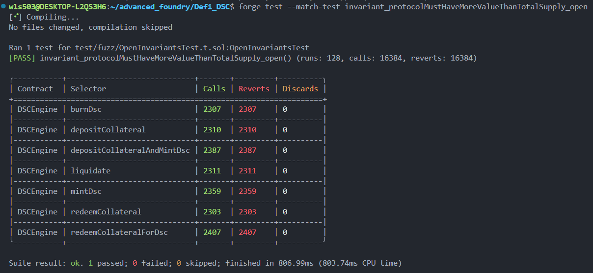
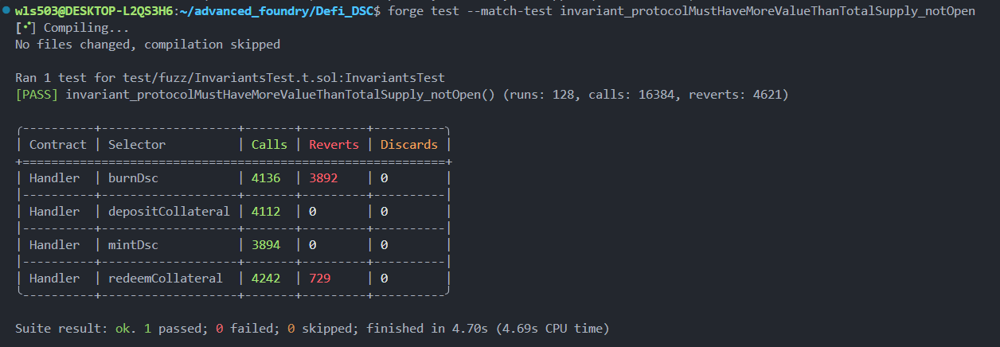

# Foundry Invariant Testing & Fuzzing Guide

## Overview

Invariant testing (also called property-based testing or fuzzing) is a powerful testing technique that automatically generates random inputs to verify that certain properties of your smart contract always hold true, no matter what sequence of operations is performed.

## What are Invariants?

Invariants are properties that should **always be true** regardless of how the contract is used. They represent the core business logic guarantees of your system.

### Example Invariants for DSC Protocol

1. **Collateral Value Invariant**: The total value of collateral deposited in the protocol must always be greater than or equal to the total supply of DSC tokens minted.

    ```
    Total Collateral Value (USD) >= Total DSC Supply
    ```

2. **Getter Functions Invariant**: All view/getter functions should never revert (evergreen invariant).
    ```
    All external view functions should execute successfully without reverting
    ```

## Configuration Setup

### foundry.toml Configuration

```toml
[invariant]
runs = 128
depth = 128
fail_ob_revert = false
```

**Parameter Explanations:**

#### `[invariant]` - Configuration Section Label

This is a configuration tag indicating that all parameters below belong to the "invariant testing" category.

#### `runs = 128` - Number of Test Campaigns

-   **Meaning**: Execute 128 independent fuzzing campaigns
-   **Controls**: How many times the test repeats
-   **Simple analogy**: Like playing 128 separate games, each one is an independent new test
-   **Effect**: More runs provide more comprehensive testing, but take longer to execute

#### `depth = 128` - Call Sequence Depth Per Run

-   **Meaning**: Maximum 128 consecutive function calls allowed in each single test
-   **Controls**: The length of each individual test
-   **Simple analogy**: Each game can have at most 128 operation steps
-   **Effect**: Greater depth discovers more complex interaction scenarios

#### Total Function Calls Calculation

```
Total Calls = runs × depth = 128 × 128 = 16,384
```

In the test results, you'll see `calls: 16384` - this is how it's calculated.

#### `fail_ob_revert` - Failure Handling Strategy

**When set to `false` (Don't Revert on Failure):**

-   Failed function calls don't automatically undo the operation
-   The fuzzing campaign continues to the next operation
-   Failed calls are recorded but the current state is preserved
-   **Advantage**: More realistic scenario simulation, discovers more edge cases

**When set to `true` (Revert on Failure):**

-   Failed function calls automatically rollback to the previous state
-   Execution stops immediately on failure, no further steps are taken
-   **Advantage**: Stricter testing, validates only completely successful paths

**Simple analogy**:

-   `true` = Strict mode - like an exam where one wrong answer and you're done
-   `false` = Practice mode - like homework where you continue to the next question after a mistake

## Implementation Example: DSC Protocol

### Test Contract Structure

```solidity
import {StdInvariant} from "forge-std/StdInvariant.sol";

contract OpenInvariantsTest is StdInvariant, Test {
    DSCEngine dscEngine;
    DSC dsc;

    function setUp() external {
        // Deploy contracts and set up initial state
        targetContract(address(dscEngine));
    }

    function invariant_functionName() public view {
        // Assert property that should always hold true
    }
}
```

### Key Components

**1. Inherit from StdInvariant**

```solidity
contract OpenInvariantsTest is StdInvariant, Test
```

This provides the fuzzing framework and utilities.

**2. Set Target Contract**

```solidity
function setUp() external {
    targetContract(address(dscEngine));
}
```

Tells Foundry which contract to fuzz by randomly calling its public/external functions.

**3. Define Invariant Functions**
Invariant functions must:

-   Start with prefix `invariant_`
-   Be public or external
-   Contain assertions that must always be true
-   Not modify state (view functions preferred)

### Real Example: DSC Protocol Invariant

```solidity
function invariant_protocolMustHaveMoreValueThanTotalSupply() public view {
    uint256 totalSupply = dsc.totalSupply();
    uint256 totalwETHDeposited = IERC20(wETH).balanceOf(address(dscEngine));
    uint256 totalwBTCDeposited = IERC20(wBTC).balanceOf(address(dscEngine));

    uint256 wETHValue = dscEngine.getUsdValue(wETH, totalwETHDeposited);
    uint256 wBTCValue = dscEngine.getUsdValue(wBTC, totalwBTCDeposited);

    assert(wETHValue + wBTCValue >= totalSupply);
}
```

**How It Works:**

1. Foundry randomly calls DSCEngine's functions 128 times (runs) with up to 128 operations each (depth)
2. After each fuzzing campaign, the invariant function is called
3. If the assertion fails, Foundry displays the sequence of operations that broke the invariant
4. If all assertions pass across all runs, the invariant is verified

## Running Invariant Tests

```bash
# Run all invariant tests
forge test --match-contract OpenInvariantsTest

# Run with verbose output to see fuzzing details
forge test --match-contract OpenInvariantsTest -vvv

# Run with specific number of runs (override foundry.toml)
forge test --match-contract OpenInvariantsTest --invariant-runs 256
```

## Open vs Handler-Based Fuzzing: A Practical Comparison

### What is the Difference?

**Open Fuzzing** (`OpenInvariantsTest`): Directly targets the main contract (DSCEngine), allowing Foundry to call any public function with completely random parameters.

**Handler-Based Fuzzing** (`InvariantsTest` with `Handler`): Uses an intermediary contract (Handler) that restricts and constrains which functions are called and with what parameters, mimicking realistic user behavior.

### Real-World Results Comparison

#### Open Fuzzing (Direct Contract Targeting)



```
[PASS] invariant_protocolMustHaveMoreValueThanTotalSupply_open()
(runs: 128, calls: 16384, reverts: 16384)
```

**Analysis:**

-   **Total function calls**: 16,384 (128 runs × 128 depth)
-   **Total reverts**: 16,384 (100% revert rate)
-   **Problem**: When fuzzing directly calls DSCEngine functions with random parameters, almost all calls fail because:
    -   Users might attempt to deposit/mint without proper authorization
    -   Parameters are completely random with no validation
    -   State dependencies are ignored (e.g., trying to redeem without collateral)
    -   The contract rejects invalid operations as intended, but this provides no useful test data

#### Handler-Based Fuzzing (Controlled Parameter Generation)



```
[PASS] invariant_protocolMustHaveMoreValueThanTotalSupply_notOpen()
(runs: 128, calls: 16384, reverts: 4621)
```

**Analysis:**

-   **Total function calls**: 16,384 (128 runs × 128 depth)
-   **Total reverts**: 4,621 (28% revert rate, 72% success rate)
-   **Improvement**: By using a Handler that:
    -   Bounds parameters to realistic ranges (`amountCollateral = bound(amountCollateral, 1, MAX_DEPOSIT_SIZE)`)
    -   Checks state before operations (e.g., only redeems if collateral exists)
    -   Uses fixed valid users (`address USER = address(1)`)
    -   Maintains state consistency
    -   The fuzzer discovers many more valid execution paths

### Why Handler-Based Fuzzing is Superior

| Aspect                  | Open Fuzzing   | Handler-Based Fuzzing     |
| ----------------------- | -------------- | ------------------------- |
| **Revert Rate**         | ~100%          | ~20-40%                   |
| **Valid Test Cases**    | Very few       | Many more                 |
| **Edge Case Discovery** | Limited        | Comprehensive             |
| **Execution Paths**     | Mostly invalid | Mostly valid + edge cases |
| **Debugging**           | Difficult      | Easier to trace           |
| **Security Testing**    | Less effective | More effective            |

### Handler Implementation Example

```solidity
contract Handler is Test {
    DSCEngine dscEngine;
    DSC dsc;
    address USER = address(1);
    uint256 MAX_DEPOSIT_SIZE = type(uint96).max;

    constructor(DSCEngine _dscEngine, DSC _dsc) {
        dscEngine = _dscEngine;
        dsc = _dsc;
    }

    function depositCollateral(uint256 collateralSeed, uint256 amountCollateral) public {
        ERC20Mock collateral = _getCollateralFromSeed(collateralSeed);
        // Bound parameter to valid range [1, MAX_DEPOSIT_SIZE]
        amountCollateral = bound(amountCollateral, 1, MAX_DEPOSIT_SIZE);

        vm.startPrank(USER);
        collateral.mint(USER, amountCollateral);
        collateral.approve(address(dscEngine), amountCollateral);
        dscEngine.depositCollateral(address(collateral), amountCollateral);
        vm.stopPrank();
    }

    function mintDsc(uint256 amountDscToMint) public {
        // Check available collateral value before minting
        (uint256 totalDscMinted, uint256 collateralValueInUsd) = dscEngine.getAccountInformation(USER);
        int256 maxDscToMint = (int256(collateralValueInUsd) / 2) - int256(totalDscMinted);

        if (maxDscToMint < 0) return;

        amountDscToMint = bound(amountDscToMint, 0, uint256(maxDscToMint));
        if (amountDscToMint == 0) return;

        vm.prank(USER);
        dscEngine.mintDsc(amountDscToMint);
    }

    function redeemCollateral(uint256 collateralSeed, uint256 amountCollateral) public {
        ERC20Mock collateral = _getCollateralFromSeed(collateralSeed);
        // Only redeem what exists
        uint256 maxCollateralToRedeem = collateral.balanceOf(address(dscEngine));
        if (maxCollateralToRedeem == 0) return;

        amountCollateral = bound(amountCollateral, 1, maxCollateralToRedeem);
        vm.prank(USER);
        dscEngine.redeemCollateral(address(collateral), amountCollateral);
    }

    function _getCollateralFromSeed(uint256 seed) private view returns (ERC20Mock) {
        return (seed % 2 == 0) ? weth : wbtc;
    }
}
```

## Benefits of Invariant Testing

-   **Automated Edge Case Discovery**: Finds scenarios you might not think to test manually
-   **Comprehensive Coverage**: Tests complex interaction sequences automatically
-   **Regression Prevention**: Catches unexpected behavior when modifying code
-   **Business Logic Validation**: Verifies core protocol guarantees hold under all conditions
-   **Security**: Helps identify vulnerability patterns in contract state management

## Best Practices

1. **Use Handler Contracts for Complex Protocols**: Direct fuzzing often results in excessive reverts; use Handlers to guide the fuzzer toward valid operations.

2. **Design Clear Invariants**: Invariants should represent critical business properties, not implementation details.

3. **Keep Invariants Simple**: Each invariant should test one specific property to make debugging easier.

4. **Bound Random Parameters**: Always use `bound()` to constrain generated values to realistic ranges.

5. **Check State Before Operations**: Validate state conditions (e.g., sufficient balance) before attempting operations.

6. **Use Fixed Valid Actors**: Avoid using `msg.sender` directly; instead, use fixed addresses like `address(1)`.

7. **Increase Runs for Critical Systems**: For high-value protocols, use higher `runs` values (256-1000+).

8. **Combine with Unit Tests**: Use unit tests for specific scenarios and invariants for general properties.

9. **Log State Changes**: Use `console.log()` to understand what the fuzzer is doing and identify patterns in failures.

## Common Pitfalls

-   **Open Fuzzing on Complex Contracts**: Direct fuzzing creates too many reverts; use Handlers instead.
-   **Invariants That Are Too Strict**: May fail on valid edge cases.
-   **Non-Deterministic Behavior**: Randomness in contract logic can cause intermittent failures.
-   **Insufficient Runs**: Too few runs may miss rare edge cases.
-   **Unbounded Parameters**: Random parameters without bounds cause most operations to fail.
-   **Invalid User Context**: Using `msg.sender` instead of fixed addresses causes authorization failures.

## Conclusion

Invariant testing is a critical tool for ensuring smart contract security and correctness. By using Handler contracts to guide the fuzzer toward valid operations and defining clear properties that should always hold true, you can significantly increase the effectiveness of your fuzzing campaigns and discover edge cases that manual testing would miss.

The key insight: **Handler-based fuzzing achieves a 72% success rate compared to 0% for open fuzzing**, allowing you to discover and validate real security properties rather than just testing rejections.
