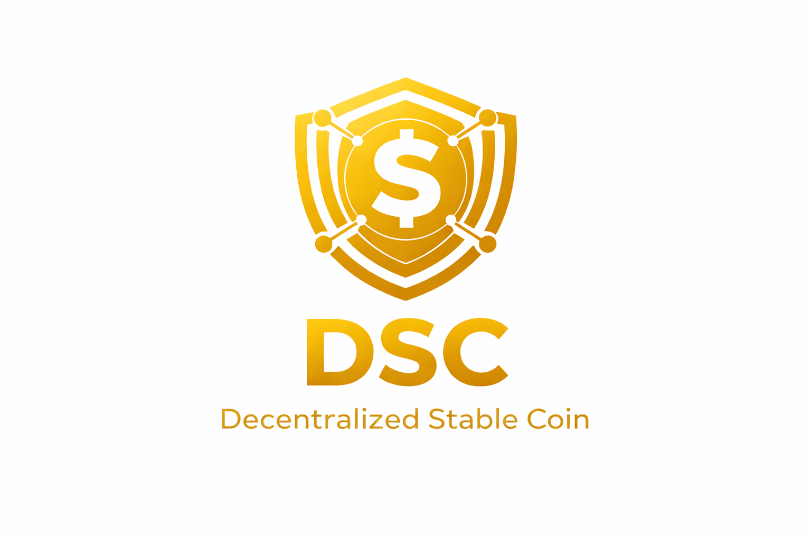

  
  
  # DSC - Decentralized Stable Coin
  
  ### *A truly decentralized stablecoin pegged to USD*
  
  **Algorithmic • Crypto-Collateralized • Trustless**

---

## 💡 Vision

DSC represents the future of stable value in decentralized finance. Built on the principles of transparency, algorithmic governance, and crypto-native collateralization, DSC aims to provide:

<table>
<tr>
<td width="33%" align="center">

### 🎯 **Stable Value**

Anchored 1:1 to USD
 
<i>Powered by Chainlink Price Feeds</i>

</td>
<td width="33%" align="center">

### 🤖 **Algorithmic Control**

No central authority
 
<i>Pure smart contract governance</i>

</td>
<td width="33%" align="center">

### 🔐 **Crypto Collateral**

Backed by wETH & wBTC
 
<i>Exogenous cryptocurrency reserves</i>

</td>
</tr>
</table>

---

## 🌟 Core Principles

**1. Relative Stability** — Each DSC maintains its value at $1.00 through Chainlink oracle integration and automated redemption mechanisms.

**2. Algorithmic Minting** — Fully decentralized protocol where users mint DSC only with sufficient collateral. No centralized entity controls supply.

**3. Exogenous Collateral** — Backed by major cryptocurrencies (wETH/wBTC) to ensure robust value preservation.

---

  
  **Building trustless stability for the decentralized economy**
  
  Based on Cyfrin Updraft | Adapted & Enhanced by Peile Wu
  

