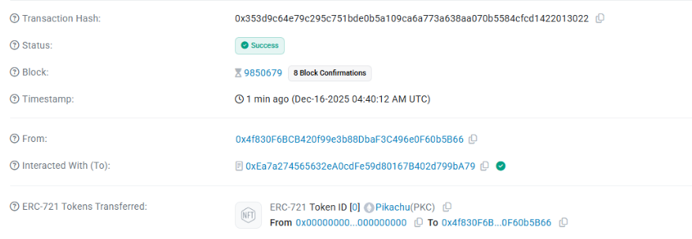
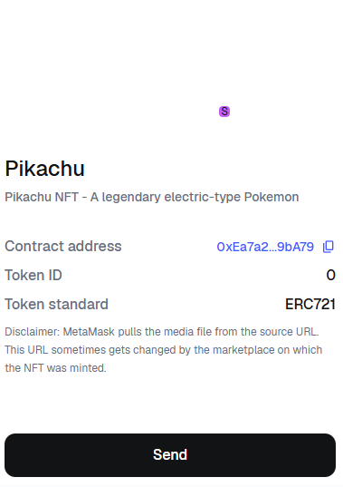

# Basic NFT with IPFS - Technical Guide

## Technologies Used

-   **Solidity ^0.8.18**: Smart contract language
-   **Foundry**: Development framework (forge, cast, anvil)
-   **OpenZeppelin ERC721**: NFT standard implementation
-   **foundry-devops**: Utility library for contract address management
-   **IPFS**: Decentralized storage for NFT metadata and assets
-   **IPFS Desktop**: GUI client for IPFS node management

## Smart Contract Architecture

### BasicNFT.sol

```solidity
contract BasicNFT is ERC721 {
    uint256 private s_tokenCounter;
    mapping(uint256 => string) private s_tokenIdToUri;

    constructor() ERC721("Pikachu", "PKC") {
        s_tokenCounter = 0;
    }

    function mintNFT(string memory tokenUri) public {
        s_tokenIdToUri[s_tokenCounter] = tokenUri;
        _safeMint(msg.sender, s_tokenCounter);
        s_tokenCounter++;
    }

    function tokenURI(uint256 tokenId) public view override returns (string memory) {
        return s_tokenIdToUri[tokenId];
    }
}
```

**Key Features**:

-   Inherits OpenZeppelin's ERC721 implementation
-   Token counter tracks total minted NFTs
-   Mapping stores IPFS URI for each token ID
-   Custom `tokenURI` override to return IPFS metadata

## IPFS Integration Workflow

### 1. Install IPFS Desktop

Download from: https://github.com/ipfs/ipfs-desktop/releases

Installation guide: https://docs.ipfs.tech/install/ipfs-desktop/#install-instructions

After installation:

-   Install IPFS Desktop application
-   Install Chrome extension for IPFS

### 2. Upload Asset File

-   Open IPFS Desktop
-   Drag and drop image/GIF file
-   Copy the CID (Content Identifier)

**Example**: `QmTCoshZqeFsUNrcGAhsqKrnNQg54kqzACdD1MEbDJYPLs`

### 3. Create JSON Metadata

Create `metadata.json` with ERC721 standard format:

```json
{
    "name": "Pikachu",
    "description": "Pikachu NFT - A legendary electric-type Pokemon",
    "image": "ipfs://QmTCoshZqeFsUNrcGAhsqKrnNQg54kqzACdD1MEbDJYPLs",
    "attributes": [
        {
            "trait_type": "Type",
            "value": "Electric"
        },
        {
            "trait_type": "Token Symbol",
            "value": "PKC"
        }
    ]
}
```

**Important**: The `image` field references the asset CID from step 2.

### 4. Upload JSON Metadata

-   Upload `metadata.json` to IPFS Desktop
-   Copy the JSON file's CID

**Example**: `QmQNxRp7HCoUBnsUTQLc1cQcHP682uj8fdHBNEXCGHkk6n`

### 5. Use JSON CID in Contract

```solidity
string public constant PIKACHU_URI =
    "ipfs://QmQNxRp7HCoUBnsUTQLc1cQcHP682uj8fdHBNEXCGHkk6n";
```

## File Persistence with Pinata

IPFS files are only available when nodes are online. Use pinning services for permanence:

1. Register at https://pinata.cloud
2. Navigate to Upload → By CID
3. Pin both the asset CID and JSON CID
4. Files remain accessible even when local node is offline

## Configuration

### foundry.toml Setup

Add the following configurations to enable FFI and file system permissions:

```toml
[profile.default]
src = "src"
out = "out"
libs = ["lib"]
fs_permissions = [{ access = "read", path = "./broadcast" }]
remappings = ["@openzeppelin/contracts=lib/openzeppelin-contracts/contracts"]
ffi = true
```

**Key Settings**:

-   `ffi = true`: Enables Foreign Function Interface for foundry-devops
-   `fs_permissions`: Grants read access to broadcast directory for deployment tracking

### Makefile

Create a `Makefile` for streamlined commands:

```makefile
-include .env

.PHONY: all test clean deploy mint help install snapshot format anvil

all: clean remove install update build

# Clean the repo
clean :; forge clean

# Remove modules
remove :; rm -rf .gitmodules && rm -rf .git/modules/* && rm -rf lib && touch .gitmodules && git add . && git commit -m "modules"

# Install dependencies
install :; forge install cyfrin/foundry-devops@0.2.2 --no-commit && forge install foundry-rs/forge-std@v1.8.2 --no-commit && forge install openzeppelin/openzeppelin-contracts@v5.0.2 --no-commit

# Update Dependencies
update :; forge update

# Build the project
build :; forge build

# Run tests
test :; forge test

# Take a snapshot
snapshot :; forge snapshot

# Format code
format :; forge fmt

# Start local Anvil node
anvil :; anvil -m 'test test test test test test test test test test test junk' --steps-tracing --block-time 1

# Deploy to Sepolia
deploy:
	@forge script script/DeployBasicNFT.s.sol:DeployBasicNFT --rpc-url $(SEPOLIA_RPC_URL) --private-key $(PRIVATE_KEY) --broadcast --verify --etherscan-api-key $(ETHERSCAN_API_KEY) -vvvv

# Mint NFT on Sepolia
mint:
	@forge script script/Interactions.s.sol:MintBasicNFT --rpc-url $(SEPOLIA_RPC_URL) --private-key $(PRIVATE_KEY) --broadcast -vvvv
```

## Testing Strategy

### BasicNFTTest.t.sol

```solidity
contract BasicNFTTest is Test {
    DeployBasicNFT public deployer;
    BasicNFT public basicNFT;
    address public USER = makeAddr("user");
    string public constant _PKC_ = "ipfs://QmQNxRp7HCoUBnsUTQLc1cQcHP682uj8fdHBNEXCGHkk6n";

    function setUp() public {
        deployer = new DeployBasicNFT();
        basicNFT = deployer.run();
    }

    function testNameIsCorrect() public view {
        string memory expectedName = "Pikachu";
        string memory actualName = basicNFT.name();
        assert(keccak256(abi.encodePacked(expectedName)) == keccak256(abi.encodePacked(actualName)));
    }

    function testMint_Balance() public {
        vm.prank(USER);
        basicNFT.mintNFT(_PKC_);

        assert(basicNFT.balanceOf(USER) == 1);
        assert(keccak256(abi.encodePacked(_PKC_)) == keccak256(abi.encodePacked(basicNFT.tokenURI(0))));
    }
}
```

**Test Coverage**:

-   Name validation using `keccak256` hash comparison
-   Minting functionality with `vm.prank` for user simulation
-   Balance verification after mint
-   TokenURI correctness check

## Scripts

### DeployBasicNFT.s.sol

```solidity
contract DeployBasicNFT is Script {
    function run() external returns (BasicNFT) {
        vm.startBroadcast();
        BasicNFT basicNft = new BasicNFT();
        vm.stopBroadcast();
        return basicNft;
    }
}
```

### Interactions.s.sol

```solidity
contract MintBasicNFT is Script {
    string public constant _PKC_ = "ipfs://QmQNxRp7HCoUBnsUTQLc1cQcHP682uj8fdHBNEXCGHkk6n";

    function run() external {
        address mostRecentlyDeployed = DevOpsTools.get_most_recent_deployment("BasicNFT", block.chainid);
        mintNftOnContract(mostRecentlyDeployed);
    }

    function mintNftOnContract(address contractAddress) public {
        vm.startBroadcast();
        BasicNFT(contractAddress).mintNFT(_PKC_);
        vm.stopBroadcast();
    }
}
```

**Purpose**: Mint NFTs on already deployed contracts without redeployment.

**Key Features**:

-   Uses `foundry-devops` to fetch the most recent deployment address
-   Separates minting logic from deployment
-   Enables interaction with existing contracts across different chains

## Deployment to Testnet

### Step-by-Step Deployment Process

1. **Configure Environment Variables**

    Create a `.env` file with:

    ```
    SEPOLIA_RPC_URL=your_rpc_url
    PRIVATE_KEY=your_private_key
    ETHERSCAN_API_KEY=your_etherscan_api_key
    ```

2. **Deploy Contract**

    Run the deployment command:

    ```bash
    make deploy
    ```

    **Deployment Result**:

    - Contract Address: `0xEa7a274565632eA0cdFe59d80167B402d799bA79`
    - Network: Sepolia Testnet
    - Status: Successfully deployed and verified

3. **Mint NFT**

    Execute the minting command:

    ```bash
    make mint
    ```

    **Minting Result**:

    - Transaction Hash: `0x353d9c64e79c295c751bde0b5a109ca6a773a638aa070b5584cfcd1422013022`
    - Status: Successfully minted
    - Viewable on block explorer

    

4. **Import NFT to MetaMask**

    Manually import the NFT in MetaMask:

    - Open MetaMask
    - Navigate to NFTs tab
    - Click "Import NFT"
    - Enter contract address: `0xEa7a274565632eA0cdFe59d80167B402d799bA79`
    - Enter token ID: `0`

    

## Commands

```bash
# Install dependencies
make install

# Run tests
make test

# Build project
make build

# Deploy to Sepolia testnet
make deploy

# Mint NFT on deployed contract
make mint

# Start local Anvil node
make anvil

# Format code
make format

# Clean project
make clean
```

### Alternative Commands (without Makefile)

```bash
# Install dependencies
forge install OpenZeppelin/openzeppelin-contracts
forge install Cyfrin/foundry-devops --no-commit

# Run tests
forge test

# Deploy to local anvil
forge script script/DeployBasicNFT.s.sol --rpc-url http://localhost:8545 --private-key $PRIVATE_KEY --broadcast

# Deploy to testnet
forge script script/DeployBasicNFT.s.sol --rpc-url $SEPOLIA_RPC_URL --private-key $PRIVATE_KEY --broadcast

# Mint NFT on deployed contract
forge script script/Interactions.s.sol --rpc-url $SEPOLIA_RPC_URL --private-key $PRIVATE_KEY --broadcast
```

## IPFS Gateway Access

Verify uploaded content via public gateways:

```
https://ipfs.io/ipfs/[CID]
https://cloudflare-ipfs.com/ipfs/[CID]
https://gateway.pinata.cloud/ipfs/[CID]
```

## NFT Metadata Structure

```
Smart Contract (tokenURI)
    ↓
JSON Metadata (ipfs://QmQNx...)
    ├─ name: "Pikachu"
    ├─ description: "..."
    └─ image: "ipfs://QmTCo..."
              ↓
         Asset File (GIF/PNG)
```

## Project Structure

```
foundry_nft/
├── broadcast/           # Deployment artifacts
├── cache/              # Build cache
├── img/                # Documentation images
│   ├── giphy.gif
│   ├── import_NFT.png
│   └── mint_pikachu.png
├── lib/                # Dependencies
│   ├── forge-std
│   ├── foundry-devops
│   └── openzeppelin-contracts
├── out/                # Compiled contracts
├── script/             # Deployment scripts
│   ├── DeployBasicNFT.s.sol
│   └── Interactions.s.sol
├── src/                # Smart contracts
│   └── BasicNFT.sol
├── test/               # Test files
│   └── BasicNFTTest.t.sol
├── .env                # Environment variables
├── foundry.toml        # Foundry configuration
└── Makefile            # Build automation
```

## Key Concepts

**Content Addressing**: IPFS uses cryptographic hashes (CIDs) instead of location-based URLs. Same content = same CID.

**Decentralization**: Files are distributed across multiple nodes, eliminating single points of failure.

**Immutability**: Content cannot be changed without generating a new CID, providing built-in version control.

**ERC721 Standard**: `tokenURI` function must return metadata URI. NFT marketplaces (OpenSea, Rarible) parse this to display NFT information.

**foundry-devops**: Tracks deployed contracts via broadcast artifacts in `broadcast/` directory. `DevOpsTools.get_most_recent_deployment()` retrieves the latest contract address for a given chain, enabling seamless interaction without hardcoding addresses.

**FFI (Foreign Function Interface)**: Allows Foundry scripts to execute external commands and read file system data, required for foundry-devops to track deployments.

## Troubleshooting

### Common Issues

1. **FFI not enabled**

    - Error: `FFI is not enabled`
    - Solution: Set `ffi = true` in `foundry.toml`

2. **File permissions error**

    - Error: `Access denied to ./broadcast`
    - Solution: Add `fs_permissions = [{ access = "read", path = "./broadcast" }]` to `foundry.toml`

3. **IPFS node offline**

    - Issue: Cannot access uploaded files
    - Solution: Pin files to Pinata or another pinning service

4. **MetaMask not showing NFT**
    - Issue: NFT not visible after minting
    - Solution: Manually import using contract address and token ID

## Security Considerations

-   Never commit `.env` file to version control
-   Use environment variables for sensitive data
-   Verify contract on Etherscan for transparency
-   Test thoroughly on testnet before mainnet deployment
-   Consider using multi-sig wallets for contract ownership

## Resources

-   [OpenZeppelin ERC721 Documentation](https://docs.openzeppelin.com/contracts/erc721)
-   [Foundry Book](https://book.getfoundry.sh/)
-   [IPFS Documentation](https://docs.ipfs.tech/)
-   [Pinata Documentation](https://docs.pinata.cloud/)
-   [foundry-devops Repository](https://github.com/Cyfrin/foundry-devops)
